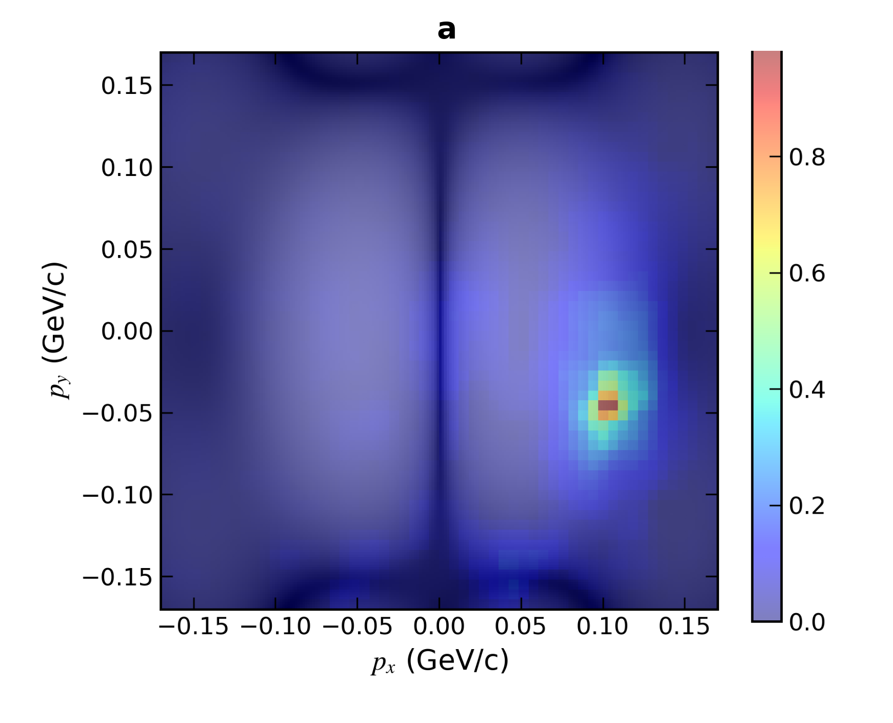
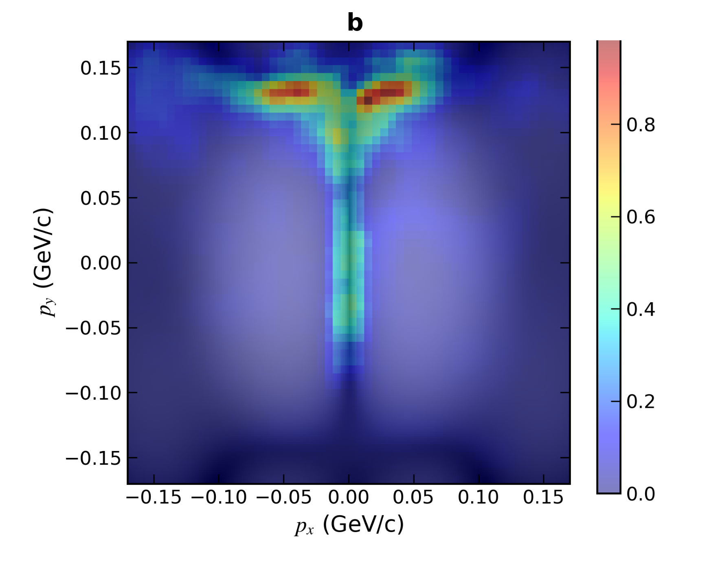

# ResNet-UPC: Deep Learning for Interference Pattern Analysis

A PyTorch research codebase for analyzing momentum-space interference/diffraction
images ($(p_x, p_y)$ spectra in GeV/c) from ultra-peripheral collision (UPC) physics
simulations. The project progresses from simple image classification to multi-task
physics-parameter regression with uncertainty quantification and explainability.

**Core tasks**

- **Classification** — categorize interference patterns into discrete classes
  (`class0/1/2`) with an ImageNet-pretrained ResNet-34.
- **Regression** — predict continuous physics parameters $(\beta_2, \beta_3)$ and
  $R_2$ directly from the images.
- **Uncertainty quantification** — variational Gaussian Process (GP) heads
  (GPyTorch) on top of ResNet features.
- **Multi-task learning** — joint regression + classification with **GradNorm**
  dynamic loss weighting.
- **Explainability** — Grad-CAM and Prediction Difference Analysis (PDA) heatmaps
  showing which regions of the momentum spectrum drive each prediction.

| Classification PDA map | Regression PDA map |
| :---: | :---: |
|  |  |

The classification head focuses on the bright diffraction spot, while the
regression head attends to the interference fringe structure — evidence that the
model picks up physically meaningful features.

## Repository layout

The repository is organized as a series of experiments, roughly in chronological
order of the study. Each directory is self-contained (own `config.yaml`,
`train*.py`, `inference.py` / `test_*.py`).

| Directory | Contents |
| --- | --- |
| `pre_exp1_classify_beta2&3/` | Baseline: ResNet-34 image classification with discriminative (layer-wise) learning rates. See `README_zh.md` inside for a detailed (Chinese) guide. |
| `pre_exp2_bay_seperate_beta2&3/` | Separate regression models for $\beta_2$ and $\beta_3$. |
| `pre_expO16_bay_R2/` | $R_2$ prediction (regression or discretized classification) with a ResNet + variational GP head. |
| `exp3_bay_beta2&beta3/` | Joint $(\beta_2, \beta_3)$ regression with a **ResNet + variational GP** (GPyTorch) for predictive uncertainty. `*_O16` variants handle the O16 dataset. |
| `exp4_beta2_beta3_ns/` | **Main experiments**: multi-task ResNet (regression of $\beta_2,\beta_3$ + 3-way classification) with **GradNorm** task balancing, plus several ablations (see below). |
| `seg_design/` | Exploratory "learnable observation window" designs: learnable Gaussian region masks that move to informative areas of the momentum spectrum, Gumbel–Sinkhorn routers, and attention-based variants. |
| `upload_huggingface.py` | Robust batch uploader for publishing the dataset to a HuggingFace dataset repo (tar packaging, Git LFS, retries, resumable logs). |
| `pda_title.py` | Small utility to crop/re-title PDA heatmap figures for the paper. |
| `class.png`, `regression.png`, `a.png` | Paper figures (PDA explainability maps). |
| `requirment.txt` | Python dependencies. |

### `exp4_beta2_beta3_ns/` — main multi-task experiments

| File | Purpose |
| --- | --- |
| `train2.py` | Multi-task training: shared ResNet-34 feature extractor → MLP heads for regression ($\beta_2,\beta_3$) and classification, balanced by GradNorm. |
| `train3.py`, `train_only1.py` | Training variants / single-task ablations. |
| `train_sym.py`, `train_sym_updown.py` | Symmetry-aware training: images are split along the central axis and mirrored, with an auxiliary left/right (or up/down) classification task exploiting the physics symmetry. |
| `train_mask.py` | Training with a learnable soft dark-stripe mask. |
| `test_multitask.py`, `test_multitask_plot.py` | Evaluation: metrics, prediction dumps (`.npz`), feature extraction, Grad-CAM, and summary plots. See the (Chinese) `readme.md` in this directory for a full walkthrough. |
| `test_pdaonly.py` | PDA (Prediction Difference Analysis) explainability with paper-style heatmap rendering. |
| `test_noise_plot.py` | Noise-robustness evaluation and plotting. |
| `config*.yaml` | Configs for training and the various test modes (`config_test*.yaml`, incl. coherent/incoherent plot configs). |

### `seg_design/` — learnable observation windows

Prototype modules where the model itself learns *where to look*:

- `exp_learnable_mask.py` — `LearnableMultiRegionGenerator`: multiple learnable
  Gaussian probe windows that migrate to key locations of the momentum spectrum
  (e.g. bright spot vs. dark fringes) during training.
- `exp_learnable_mask_router.py`, `exp_learnable_pTphimask_router.py` — add a
  Gumbel–Sinkhorn router to select/combine regions.
- `exp_learnable_pTphimask_attention.py` — attention-based region combination.

## Data format

Datasets are directories of `.npy` files (single-channel 2-D arrays of the
momentum spectrum, e.g. 645×645), with labels encoded in the file names:

```
class2_val_sample_0090_beta2_0.1133_beta3_0.1333_files_21.npy   # classification + regression
..._R2_0.85_...npy                                              # R2 experiments
```

- `class{k}` — class label ($k \in \{0,1,2\}$ for the 3-class experiments)
- `beta2_<float>_beta3_<float>` — regression targets
- `R2_<float>` — $R_2$ target for the `pre_expO16_bay_R2` experiment

Labels are parsed from file names at load time; no separate annotation files are
needed. Raw data and experiment outputs are excluded via `.gitignore`
(`data*`, `experiments*`). A processed dataset snapshot is published on
HuggingFace (see `upload_huggingface.py` for the upload pipeline).

### Preprocessing pipeline

Configured per experiment in `config.yaml` (`preprocessing:` section):

```
raw .npy (e.g. 645×645, single channel)
  → center crop (224×224)
  → log normalization
  → (optional) Gaussian spatial noise / symmetry splitting / masking
  → resize to 224×224, replicate to 3 channels
  → ImageNet normalization
```

Augmentations are deliberately conservative so as not to destroy the physical
fringe patterns.

## Installation

```bash
conda create -n resnet-upc python=3.8
conda activate resnet-upc

# PyTorch matching your CUDA version, e.g.:
pip install torch torchvision --index-url https://download.pytorch.org/whl/cu118

pip install -r requirment.txt   # numpy, pandas, scikit-learn, matplotlib,
                                # seaborn, PyYAML, tqdm, tensorboard, gpytorch,
                                # opencv-python, ...
```

## Usage

All experiments are config-driven: edit the experiment's `config.yaml`
(data path, experiment name, hyperparameters), then run its training script.

```bash
# Example 1: baseline classification
cd pre_exp1_classify_beta2\&3
python train.py

# Example 2: ResNet + variational GP regression of (beta2, beta3)
cd exp3_bay_beta2\&beta3
python train2.py

# Example 3: main multi-task experiment with GradNorm
cd exp4_beta2_beta3_ns
python train2.py

# Evaluation (metrics, features, Grad-CAM) — set mode: "test" in config_test.yaml
python test_multitask.py

# PDA explainability maps
python test_pdaonly.py --config config_pda.yaml
```

Training automatically creates an output directory per experiment:

```
experiments/<experiment_name>/
├── logs/            # TensorBoard logs  (tensorboard --logdir ...)
├── checkpoints/     # best model + periodic checkpoints
├── test_results/    # predictions (.npz), plots, Grad-CAM / PDA maps
└── training.log
```

### Key configuration knobs (`exp4_beta2_beta3_ns/config2.yaml`)

```yaml
inference_mode: "multitask_mlp"

multitask_mlp_config:
  feature_dim: 256
  regression_dims: [128, 32]
  regression_loss_type: "huber"      # mse | mae | huber
  classification_dims: [64]
  dropout: 0.4

gradnorm:
  enabled: true
  alpha: 5            # task-balancing strength (0 = fixed weights)
  lr: 0.025
  update_frequency: 10
  warmup_epochs: 5

learning_rates:
  base: 0.001
  layer_decay: 0.1    # discriminative LR: head 1e-3 → layer4 1e-4 → ... → 1e-6
use_discriminative_lr: true
```

## Method highlights

- **Discriminative learning rates** — the classification/regression head trains
  at ~1e-3 while early ResNet layers decay by 0.1 per stage down to ~1e-6,
  stabilizing transfer learning.
- **GradNorm** — task weights are learnable parameters adjusted so gradient
  magnitudes across the regression and classification tasks stay balanced
  (with warmup, constraints, and renormalization).
- **Variational GP heads** — a GPyTorch `ApproximateGP` with RBF-ARD kernel per
  target gives calibrated predictive uncertainty on top of ResNet features.
- **Physics-informed structure** — symmetry splitting (left/right mirroring with
  an auxiliary side-classification task) and learnable spatial masks encode prior
  knowledge about the symmetry and locality of the interference pattern.
- **Explainability** — Grad-CAM (target-layer configurable) and Prediction
  Difference Analysis verify that predictions rely on physically meaningful
  regions rather than artifacts.

## Notes

- Detailed Chinese guides are kept next to the code they describe:
  `pre_exp1_classify_beta2&3/README_zh.md` (classification pipeline) and
  `exp4_beta2_beta3_ns/readme.md` (multi-task testing/Grad-CAM guide).
- Data paths in the checked-in configs point to the original training server;
  update `data_path` / `test_data_path` to your local dataset location.
- `performer_noise.py` is an empty placeholder.
